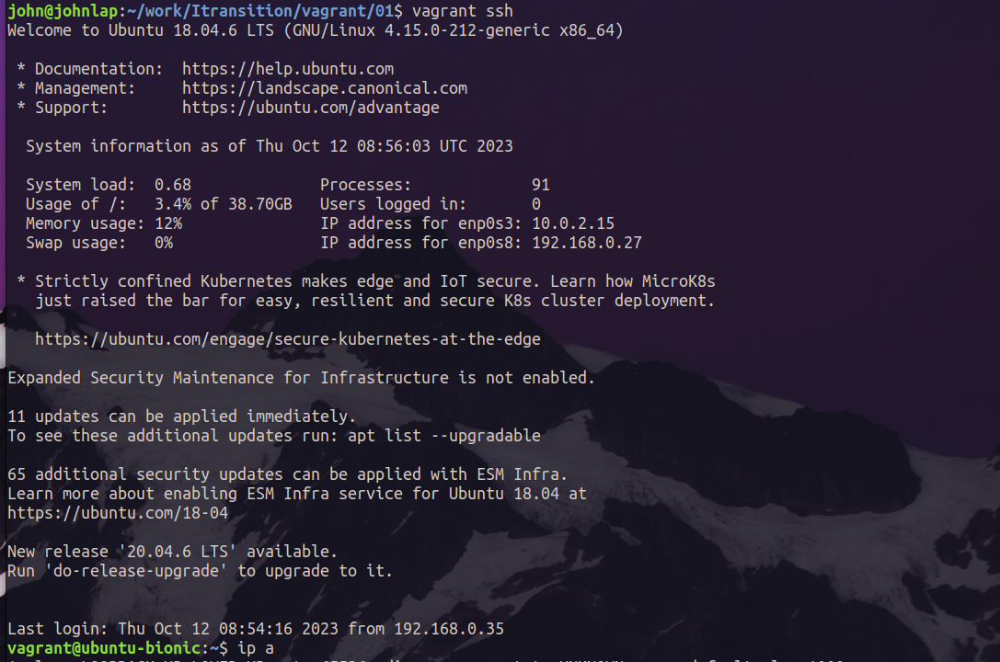
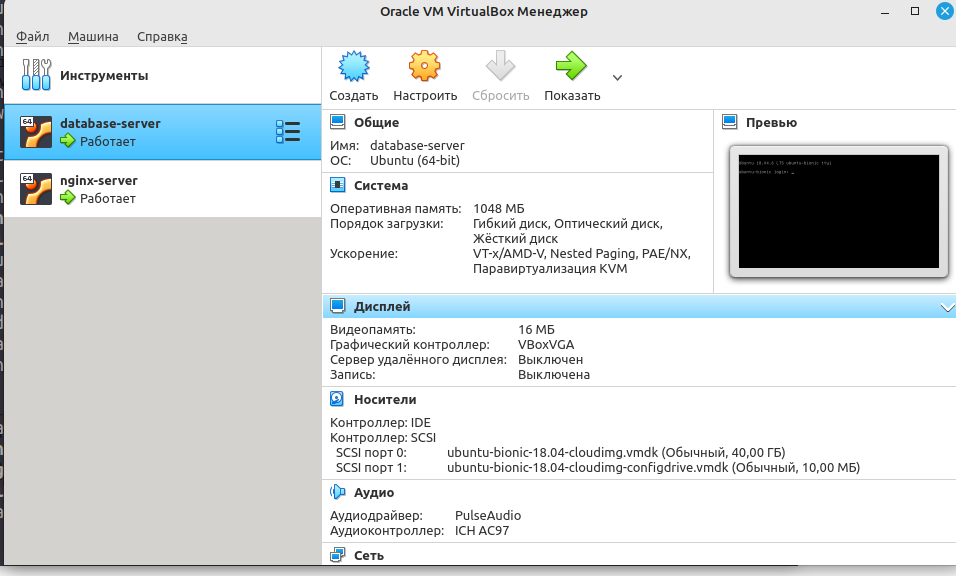
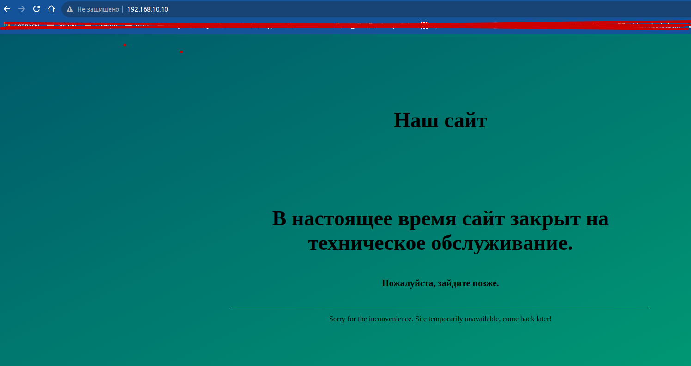

# Put header here

## 01-task

Инициировал проект vagrant с образом `ubuntu/bionic64`. Запуск VM, подключение по ssh.
Добавлен bridge интерфейс.



```sh
vagrant init ubuntu/bionic64
vagrant up
vagrant ssh
```

## 02-task

Инициировал проект vagrant с образом `ubuntu/bionic64`. Запуск 2х VM, и использование provision
для запуска shell команд. 2мя вариантами.

Изменена подсеть для Host-only Adapter
```sh
# /etc/vbox/networks.conf
* 192.168.10.0/24
```


```sh
vagrant provision
vagrant reload --provision

vagrant global-status
vagrant ssh-config
```

```sh
    web-server: Guest Additions Version: 5.2.42
    web-server: VirtualBox Version: 6.1
==> web-server: Setting hostname...
==> web-server: Configuring and enabling network interfaces...
==> web-server: Mounting shared folders...
    web-server: /vagrant => /home/john/work/Itransition/DevOps_courses/1.Containers-VMs/1.1.Vagrant+Packer
==> web-server: Running provisioner: shell...
    web-server: Running: inline script
    web-server: Installing MySQL
    web-server: Hit:1 http://archive.ubuntu.com/ubuntu bionic InRelease
    web-server: Get:2 http://security.ubuntu.com/ubuntu bionic-security InRelease [88.7 kB]
------------------------------------------------------------------------------------------------
john@johnlap:~/work/Itransition/DevOps_courses/1.Containers-VMs/1.1.Vagrant+Packer$ vagrant destroy 
==> mysql-server: VM not created. Moving on...
==> web-server: VM not created. Moving on...
```


## 03-task

Инициировал проект vagrant с образом `ubuntu/bionic64`. 

Доблен свой ssh ключ в каталоге проекта **vagrant_rsa**

1) Установка nginx
2) добавлен пользователь dev с авторизацией по ключу но без sudo
3) /tmp/file.txt - файл (Создание текстового файла с временем его создания)
```
vagrant@web-server:~$ cat /tmp/file.txt 
Thu Oct 12 19:18:05 MSK 2023
```

запуск playbook

`ansible-playbook  site_install.yml  -i inventory_dev.var`



```sh
john@johnlap:~/work/Itransition/DevOps_courses/1.Containers-VMs/1.1.Vagrant+Packer$ ansible-playbook  site_install.yml  -i inventory_dev.var

PLAY [all] *************************************************************************************************************************************************************************************

TASK [common : COMMON - install packages and etc...] *******************************************************************************************************************************************
ok: [192.168.10.10] => {
    "msg": "Start.."
}

TASK [common : COMMON - Set timezone to Europe/Moscow] *****************************************************************************************************************************************
ok: [192.168.10.10]

TASK [common : Add the user 'developer'] *******************************************************************************************************************************************************
ok: [192.168.10.10]
```

```sh
john@johnlap:~/work/Itransition/DevOps_courses/1.Containers-VMs/1.1.Vagrant+Packer$ ssh -i dev_rsa dev@192.168.10.10
Welcome to Ubuntu 18.04.6 LTS (GNU/Linux 4.15.0-212-generic x86_64)

 * Documentation:  https://help.ubuntu.com
 * Management:     https://landscape.canonical.com
 * Support:        https://ubuntu.com/advantage

  System information as of Thu Oct 12 18:53:08 MSK 2023

  System load:  0.02              Processes:             98
  Usage of /:   4.3% of 38.70GB   Users logged in:       0
  Memory usage: 16%               IP address for enp0s3: 10.0.2.15
  Swap usage:   0%                IP address for enp0s8: 192.168.10.10


Expanded Security Maintenance for Infrastructure is not enabled.

0 updates can be applied immediately.

67 additional security updates can be applied with ESM Infra.
Learn more about enabling ESM Infra service for Ubuntu 18.04 at
https://ubuntu.com/18-04

New release '20.04.6 LTS' available.
Run 'do-release-upgrade' to upgrade to it.


*** System restart required ***

The programs included with the Ubuntu system are free software;
the exact distribution terms for each program are described in the
individual files in /usr/share/doc/*/copyright.

Ubuntu comes with ABSOLUTELY NO WARRANTY, to the extent permitted by
applicable law.

dev@web-server:~$ ^C
```