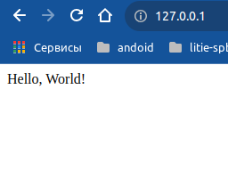

# Задача 2.4: Создание и запуск контейнера с веб-приложением в Docker

Описание: Исползовал образ python:3.6-slim, сначала добавляем пакет flask и только потом копируем flask приложение 

запускаем через CMD EXEC

#### Commands
```
docker build -t flask:04 .
docker run  -p 80:5000  --name web_server2 flask:04
```

#### Dockerfile
```
FROM python:3.6-slim

RUN pip install flask
ENV FLASK_APP="server"

COPY server.py /srv/flask_app/server.py
WORKDIR /srv/flask_app

CMD [ "python3", "-m" , "flask", "run", "--host=0.0.0.0"]
```



# Задача 2.5: Задача: Создание многоконтейнерного приложения с использованием Docker и DockerCompose

Добавил для предыдущего решения веб сервер nginx

nginx проксирует запросы на flask бекенд.

`docker-compose up`

`docker-compose down`

```
version: '3.5'

services:
    web:
      image: nginx
      depends_on:
       - flask_web
      volumes:
       - ./nginx_config.conf:/etc/nginx/conf.d/nginx_config.conf
      ports:
       - "80:8080"
      restart: unless-stopped
      networks:
       - webservices

    flask_web:
      image: flask:04
      restart: unless-stopped
      networks:
       - webservices

networks:
   webservices:

```

# Задача 2.6: Знакомство с Kubernetes и Minikube
https://kubernetes.io/ru/docs/reference/kubectl/cheatsheet/

Создал в файле свой первый pod. Использую свой образ `johnnybravo6/firs-test:0` из предыдущего задания с flask. 

Командой expose создан сервис, что бы под был доступен из вне


#### Основные команды
```bash
1) kubectl apply -f first_pod.yaml
2) kubectl expose deployment nginx-flask --type="NodePort" --port 5000
3) minikube service nginx-flask

```
```bash
#kubectl get deployments

NAME          READY   UP-TO-DATE   AVAILABLE   AGE
nginx-flask   1/1     1            1           7m27s

```

```bash
# kubectl get pods
NAME                          READY   STATUS    RESTARTS   AGE
nginx-flask-56c74c56f-lp2w8   1/1     Running   0          8m7s

```


```bash
# minikube service nginx-flask
|-----------|-------------|-------------|---------------------------|
| NAMESPACE |    NAME     | TARGET PORT |            URL            |
|-----------|-------------|-------------|---------------------------|
| default   | nginx-flask |        5000 | http://192.168.49.2:32561 |
|-----------|-------------|-------------|---------------------------|

```

```bash
# kubectl get services
NAME          TYPE           CLUSTER-IP      EXTERNAL-IP   PORT(S)          AGE
kubernetes    ClusterIP      10.96.0.1       <none>        443/TCP          163m
nginx-flask   NodePort    10.104.155.107   <none>        5000:30060/TCP   3m53s

```

### подключение к контейнеру
```bash
# kubectl exec -it nginx-flask-56c74c56f-lp2w8 /bin/bash
kubectl exec [POD] [COMMAND] is DEPRECATED and will be removed in a future version. Use kubectl exec [POD] -- [COMMAND] instead.
root@nginx-flask-56c74c56f-lp2w8:/srv/flask_app# ^
```