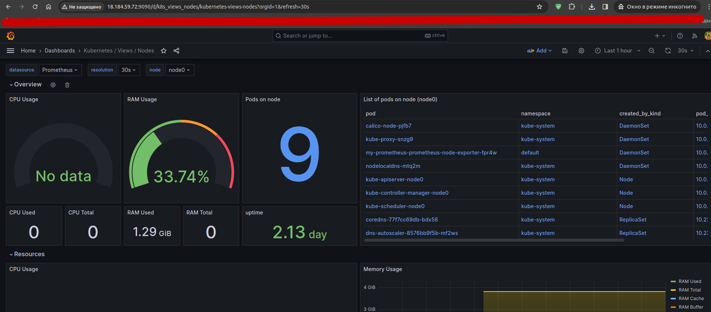

# 10 Мониторинг


### Задача 1: Установка и Настройка Prometheus и Grafana

Для выполенения задачи я развернул кластер используя kubesphere на aws vm

https://habr.com/ru/articles/725640/
https://github.com/kubernetes-sigs/kubespray


Доступные сервисы :
1) https://ec2-3-77-183-40.eu-central-1.compute.amazonaws.com/
1) https://ec2-3-77-183-40.eu-central-1.compute.amazonaws.com/grafana/
1) https://ec2-3-77-183-40.eu-central-1.compute.amazonaws.com/prometheus/graph

#### Задача 2.6:
Из задания Задача 2.6: Знакомство с Kubernetes и Minikube

`kubectl apply -f first_pod.yml`
1) https://ec2-3-77-183-40.eu-central-1.compute.amazonaws.com/hello/user


```
root@node0:~# kubectl get nodes -o wide
NAME    STATUS   ROLES           AGE     VERSION   INTERNAL-IP 
node1   Ready    control-plane   6h30m   v1.28.3   10.0.23.45 
node2   Ready    <none>          6h29m   v1.28.3   10.0.64.46 
node3   Ready    <none>          6h29m   v1.28.3   10.0.74.226 
node4   Ready    <none>          6h29m   v1.28.3   10.0.64.80 

```


### 1) Установка prometheus
Для установки helm chart были сделано:

1) Подготовка pc (файл pv_1.yml)
1) переопределены vars в values.yml
#### Команды:
```
kubectl delete pvc --all 
kubectl get all --all-namespaces

helm repo add prometheus-community https://prometheus-community.github.io/helm-charts
helm search repo prometheus-community
helm install -f values.yml prometheus-community/prometheus  --generate-name
helm upgrade -f values.yml my-prometheus prometheus-community/prometheus
helm uninstall prometheus-****
```

### 2) Установка grafana


Для установки helm chart были сделано:

1) Подготовка pc (файл pv_1.yml)
```
---
apiVersion: v1
kind: PersistentVolume
metadata:
  name: grafana-pv-01
  labels:
    type: local
spec:
  accessModes:
    - ReadWriteOnce
  capacity:
    storage: 1Gi
  hostPath:
    path: "/mnt/data/grafana01"
```
1) переопределены vars в grafana-val.yml

#### Команды:
```
kubectl get secret --namespace default grafana-1700741226 -o jsonpath="{.data.admin-password}" | base64 --decode ; echo

helm repo add grafana https://grafana.github.io/helm-charts
helm install grafana/grafana --generate-name
helm upgrade -f grafana-val.yml grafana-1700591892 grafana/grafana

```

### Задача 2: Создание Дашборда в Grafana

1) Мой Дашборд TASK:

https://ec2-3-77-183-40.eu-central-1.compute.amazonaws.com/grafana/d/a3cdd8ce-4cd9-4457-b97d-722ac8702822/task?orgId=1

1) Импортные:

https://ec2-3-77-183-40.eu-central-1.compute.amazonaws.com/grafana/d/k8s_views_nodes/kubernetes-views-nodes?orgId=1&refresh=30s

https://ec2-3-77-183-40.eu-central-1.compute.amazonaws.com/grafana/d/k8s_views_pods/kubernetes-views-pods?orgId=1&refresh=30s


### Задача 3: Создание Алертов в Prometheus и Интеграция с Grafana


### Задача 4: Масштабирование Minikube и Мониторинг с Prometheus

Сделал тут задание  - 5 Дополнительные практические задания - установка wordpress


1) Добавли БД Amazon RDS (bitnamiwordpress.**.eu-central-1.rds.amazonaws.com)
```
mysql -u admin -p -h bitnamiwordpress.cwjirezctx5q.eu-central-1.rds.amazonaws.com
SHOW DATABASES;
CREATE DATABASE wordpressdata;

create user 'user'@'%' identified by '********';
grant all privileges on wordpressdata.* TO 'user'@'%';
```

## Bitnami package for WordPress

https://github.com/bitnami/charts/tree/main/bitnami/wordpress/#installing-the-chart

Сервис:
https://ec2-3-77-183-40.eu-central-1.compute.amazonaws.com/


1) Подготовлен файл **wordpress-var.yml**


```
helm install my-release -f wordpress_val.yml  oci://registry-1.docker.io/bitnamicharts/wordpress

helm uninstall my-release

```


#### kubectl get all --all-namespaces
```
NAMESPACE     NAME                                                                READY   STATUS    RESTARTS        AGE
default       pod/grafana-1700741226-78bccb6d99-rr64s                             1/1     Running   0               49m
default       pod/my-release-wordpress-7d8bcf5d9c-qs2sb                           1/1     Running   0               70m
default       pod/nginx-flask-d86544447-9ml4h                                     1/1     Running   0               19m
default       pod/prometheus-1700740253-alertmanager-0                            1/1     Running   0               6h42m
default       pod/prometheus-1700740253-kube-state-metrics-5d65f68c88-hxfvq       1/1     Running   3 (84m ago)     6h42m
default       pod/prometheus-1700740253-prometheus-node-exporter-7s4q2            1/1     Running   0               6h42m
default       pod/prometheus-1700740253-prometheus-node-exporter-lwdxd            1/1     Running   0               6h42m
default       pod/prometheus-1700740253-prometheus-node-exporter-n68qp            1/1     Running   5 (71m ago)     6h42m
default       pod/prometheus-1700740253-prometheus-node-exporter-r8n5f            1/1     Running   0               6h42m
default       pod/prometheus-1700740253-prometheus-pushgateway-56dc886557-b6msq   1/1     Running   0               6h42m
default       pod/prometheus-1700740253-server-d8bbbc7b8-sq2pt                    2/2     Running   1 (90m ago)     6h30m
kube-system   pod/calico-kube-controllers-5fcbbfb4cb-4mh9b                        1/1     Running   0               7h
kube-system   pod/calico-node-g8rk2                                               1/1     Running   0               7h1m
kube-system   pod/calico-node-gnrmp                                               1/1     Running   0               7h1m
kube-system   pod/calico-node-mzfht                                               1/1     Running   2 (71m ago)     7h1m
kube-system   pod/calico-node-zcq68                                               1/1     Running   0               7h1m
kube-system   pod/coredns-77f7cc69db-lbxx2                                        1/1     Running   0               7h
kube-system   pod/coredns-77f7cc69db-qk7ks                                        1/1     Running   0               7h
kube-system   pod/dns-autoscaler-8576bb9f5b-x5bqp                                 1/1     Running   0               7h
kube-system   pod/kube-apiserver-node1                                            1/1     Running   1               7h3m
kube-system   pod/kube-controller-manager-node1                                   1/1     Running   2               7h3m
kube-system   pod/kube-proxy-dzwl5                                                1/1     Running   0               7h2m
kube-system   pod/kube-proxy-ftjss                                                1/1     Running   0               7h2m
kube-system   pod/kube-proxy-k4jc4                                                1/1     Running   0               7h2m
kube-system   pod/kube-proxy-mj8n4                                                1/1     Running   0               7h2m
kube-system   pod/kube-scheduler-node1                                            1/1     Running   2 (6h58m ago)   7h3m
kube-system   pod/nginx-proxy-node2                                               1/1     Running   5 (71m ago)     7h2m
kube-system   pod/nginx-proxy-node3                                               1/1     Running   0               7h2m
kube-system   pod/nginx-proxy-node4                                               1/1     Running   0               7h2m
kube-system   pod/nodelocaldns-2ll6t                                              1/1     Running   0               7h
kube-system   pod/nodelocaldns-6skxl                                              1/1     Running   0               7h
kube-system   pod/nodelocaldns-jwrtr                                              1/1     Running   0               7h
kube-system   pod/nodelocaldns-srb8b                                              1/1     Running   0               7h

NAMESPACE     NAME                                                     TYPE           CLUSTER-IP      EXTERNAL-IP   PORT(S)                      AGE
default       service/grafana-1700741226                               ClusterIP      10.233.16.210   <none>        80/TCP                       6h26m
default       service/kubernetes                                       ClusterIP      10.233.0.1      <none>        443/TCP                      7h3m
default       service/my-release-wordpress                             LoadBalancer   10.233.28.24    <pending>     80:30679/TCP,443:32478/TCP   131m
default       service/prometheus-1700740253-alertmanager               ClusterIP      10.233.47.129   <none>        9093/TCP                     6h42m
default       service/prometheus-1700740253-alertmanager-headless      ClusterIP      None            <none>        9093/TCP                     6h42m
default       service/prometheus-1700740253-kube-state-metrics         ClusterIP      10.233.44.109   <none>        8080/TCP                     6h42m
default       service/prometheus-1700740253-prometheus-node-exporter   ClusterIP      10.233.33.135   <none>        9100/TCP                     6h42m
default       service/prometheus-1700740253-prometheus-pushgateway     ClusterIP      10.233.9.137    <none>        9091/TCP                     6h42m
default       service/prometheus-1700740253-server                     ClusterIP      10.233.2.152    <none>        80/TCP                       6h42m
default       service/servicenpm                                       ClusterIP      10.233.45.6     <none>        9871/TCP                     17m
kube-system   service/coredns                                          ClusterIP      10.233.0.3      <none>        53/UDP,53/TCP,9153/TCP       7h

NAMESPACE     NAME                                                            DESIRED   CURRENT   READY   UP-TO-DATE   AVAILABLE   NODE SELECTOR            AGE
default       daemonset.apps/prometheus-1700740253-prometheus-node-exporter   4         4         4       4            4           kubernetes.io/os=linux   6h42m
kube-system   daemonset.apps/calico-node                                      4         4         4       4            4           kubernetes.io/os=linux   7h1m
kube-system   daemonset.apps/kube-proxy                                       4         4         4       4            4           kubernetes.io/os=linux   7h3m
kube-system   daemonset.apps/nodelocaldns                                     4         4         4       4            4           kubernetes.io/os=linux   7h

NAMESPACE     NAME                                                           READY   UP-TO-DATE   AVAILABLE   AGE
default       deployment.apps/grafana-1700741226                             1/1     1            1           6h26m
default       deployment.apps/my-release-wordpress                           1/1     1            1           131m
default       deployment.apps/nginx-flask                                    1/1     1            1           19m
default       deployment.apps/prometheus-1700740253-kube-state-metrics       1/1     1            1           6h42m
default       deployment.apps/prometheus-1700740253-prometheus-pushgateway   1/1     1            1           6h42m
default       deployment.apps/prometheus-1700740253-server                   1/1     1            1           6h42m
kube-system   deployment.apps/calico-kube-controllers                        1/1     1            1           7h
kube-system   deployment.apps/coredns                                        2/2     2            2           7h
kube-system   deployment.apps/dns-autoscaler                                 1/1     1            1           7h

NAMESPACE     NAME                                                                      DESIRED   CURRENT   READY   AGE
default       replicaset.apps/grafana-1700741226-78bccb6d99                             1         1         1       6h26m
default       replicaset.apps/my-release-wordpress-7d8bcf5d9c                           1         1         1       131m
default       replicaset.apps/nginx-flask-d86544447                                     1         1         1       19m
default       replicaset.apps/prometheus-1700740253-kube-state-metrics-5d65f68c88       1         1         1       6h42m
default       replicaset.apps/prometheus-1700740253-prometheus-pushgateway-56dc886557   1         1         1       6h42m
default       replicaset.apps/prometheus-1700740253-server-d8bbbc7b8                    1         1         1       6h42m
kube-system   replicaset.apps/calico-kube-controllers-5fcbbfb4cb                        1         1         1       7h
kube-system   replicaset.apps/coredns-77f7cc69db                                        2         2         2       7h
kube-system   replicaset.apps/dns-autoscaler-8576bb9f5b                                 1         1         1       7h

NAMESPACE   NAME                                                  READY   AGE
default     statefulset.apps/prometheus-1700740253-alertmanager   1/1     6h42m


```


### подключение к контейнеру
```bash
# kubectl exec -it nginx-flask-56c74c56f-lp2w8 /bin/bash
kubectl exec [POD] [COMMAND] is DEPRECATED and will be removed in a future version. Use kubectl exec [POD] -- [COMMAND] instead.
root@nginx-flask-56c74c56f-lp2w8:/srv/flask_app# ^
```


### ansible zone 
https://habr.com/ru/articles/725640/
```
cp -rfp inventory/sample inventory/mycluster
ansible-playbook -i inventory/mycluster/inventory.ini   --become --become-user=root cluster.yml


[all]
node1 ansible_host=10.0.23.45   # ip=10.3.0.1 etcd_member_name=etcd1
node2 ansible_host=10.0.64.46    # ip=10.3.0.2 etcd_member_name=etcd2
node3 ansible_host=10.0.74.226  # ip=10.3.0.3 etcd_member_name=etcd3
node4 ansible_host=10.0.64.80  # ip=10.3.0.3 etcd_member_name=etcd3

[kube_control_plane]
node1
# node2
# node3

[etcd]
node1
# node2
# node3

[kube_node]
node2
node3
node4


```


для меня, деплой дашборда
## Dashboard k8s

https://upcloud.com/resources/tutorials/deploy-kubernetes-dashboard


```
  203  kubectl delete -f kube-dash-depl.yml 
  204  kubectl apply -f kube-dash-depl.yml 
```

