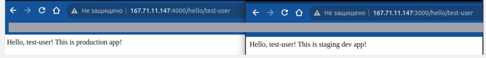
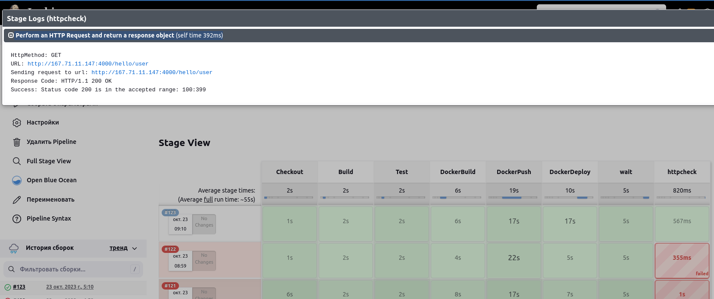
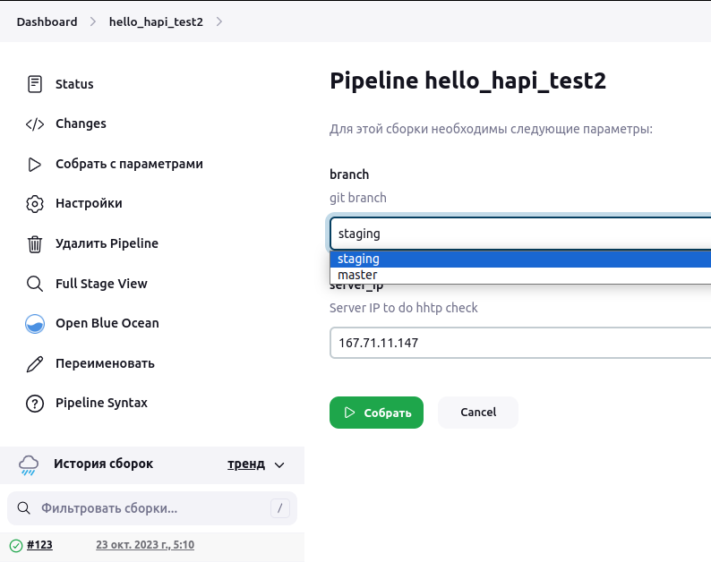

# Jenkins

#### Основной проект на node.js
1) https://github.com/banoleb/hello_hapi_test1

#### Docker hub 
1) https://hub.docker.com/r/johnnybravo6/testnpm/tags

#### Сервер приложений на digitalocean http://167.71.11.147/ 

1) http://167.71.11.147:4000/hello/test-user
1) http://167.71.11.147:3000/hello/test-user


```bash
jenkins@ubuntu-jenkins-app:~/app/hello_hapi_test1$ docker ps
CONTAINER ID   IMAGE                          COMMAND                  CREATED          STATUS          PORTS                                       NAMES
f11197a92f29   johnnybravo6/testnpm:master    "docker-entrypoint.s…"   10 minutes ago   Up 10 minutes   0.0.0.0:4000->3000/tcp, :::4000->3000/tcp   master_web-prod_1
ffeca05e58b8   johnnybravo6/testnpm:staging   "docker-entrypoint.s…"   10 hours ago     Up 10 hours     0.0.0.0:3000->3000/tcp, :::3000->3000/tcp   hello_hapi_test1_web-staging_1

```

#### Jenkins Server (поднят локально).

1) Для deploy приложения был установлен плагин **Publish Over SSH**
Авторизация на сервере по ключу, остановка контейнера, скачивание нового образа, запуск нового контейнера
1) Есть возможность выбрать 2 параметра сборки
    1) выбор **master** - prod сборка (доступна на 4000 порту)
    1) выбор **staging** - dev сборка (доступна на 3000 порту)
1) log.txt - лог последней сборки

```
version: '3.8'
services:
  jenkins:
    image: jenkins/jenkins:lts
    privileged: true
    ports:
      - 8080:8080
      - 50000:50000
    volumes:
      - ./jenkins_configuration:/var/jenkins_home
      - /var/run/docker.sock:/var/run/docker.sock
      - ./certs:/certs/client:ro
    networks:
      - jenkins
    environment:
      - DOCKER_CERT_PATH=/certs/client
```





