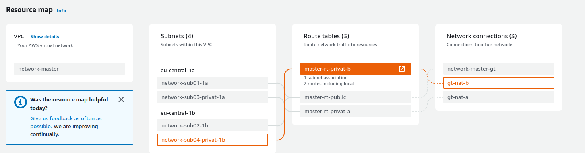
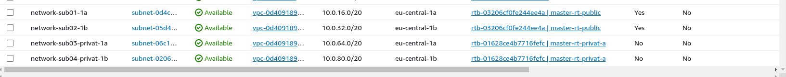
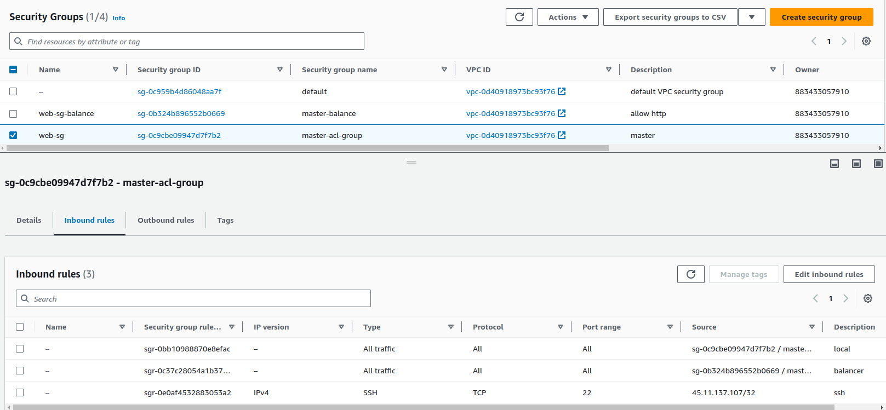
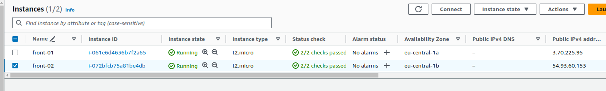
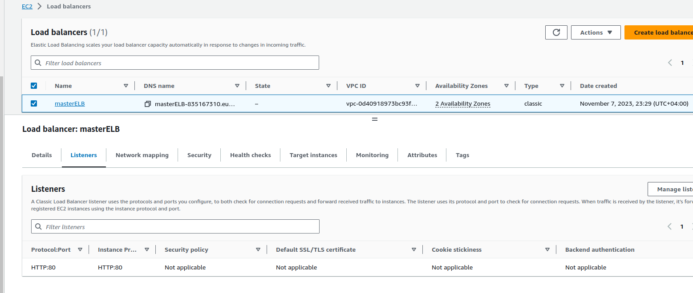
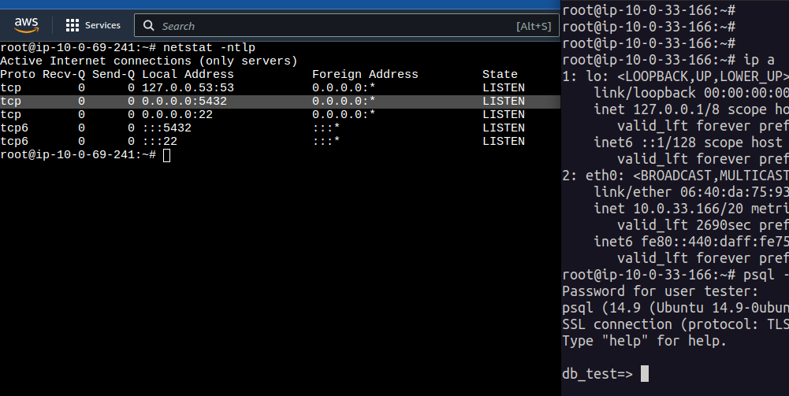
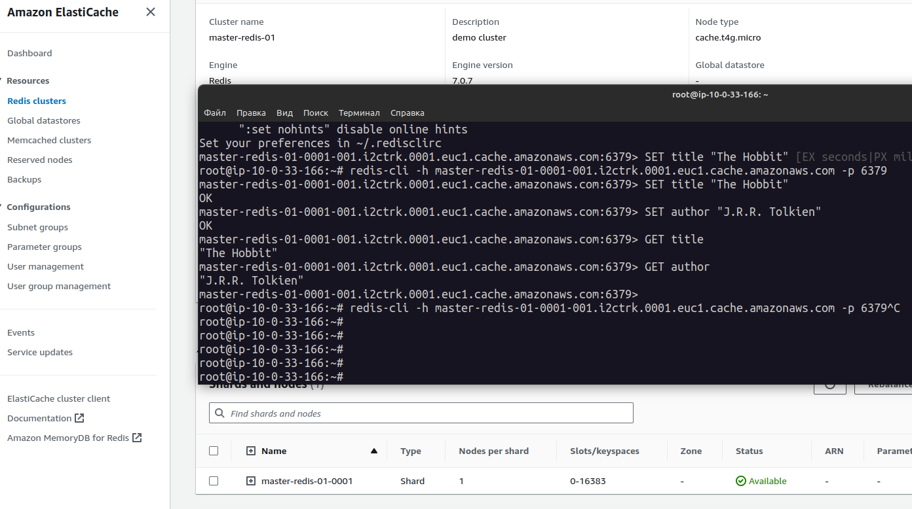
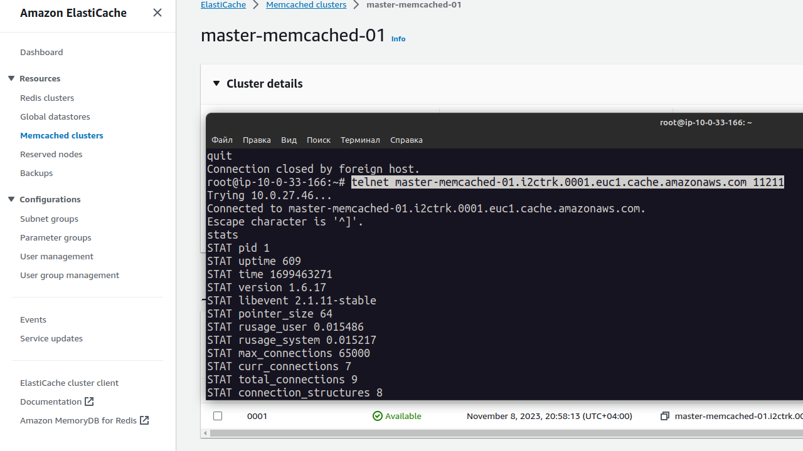
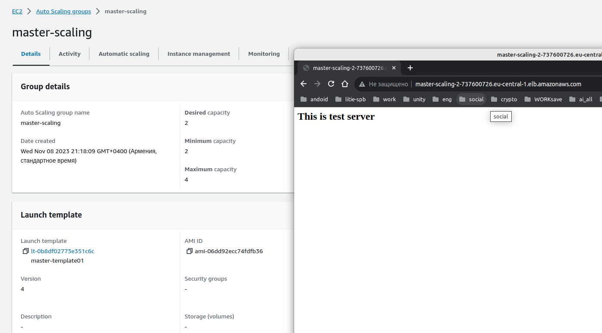
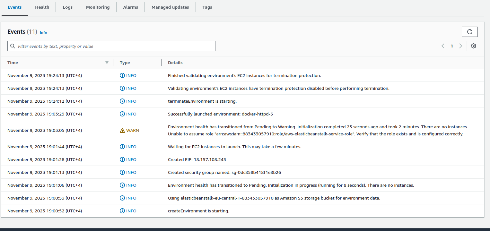

# AWS


## Часть 1 - Основы AWS
### 1. Создать выделенную сеть Amazon Virtual Private Cloud
Созданы 2 private подсети  и 2 public





### 2. Создать Security Group 

По итогу получилось сделать через 2 SG

1) Одна для Load Balancer ( Там разрешено подключение через 80 порт)
1) И вторая master-acl-group:


### 4. EC2:



### 3. Сгенерировать собственный RSA ключ (Key Pairs) для использования в дальнейшем

Сделано, без этого никуда)

### 5. ELB
Сделал через Classic Load Balancer 

Не знаю как показать еще, записал видео работы:

1) https://www.veed.io/view/d9610d79-a58e-4e74-a5a3-ad5acc314eb4?sharingWidget=true&panel=share




### 6.RDS

Создал интанс t2.micro с PostgreSQL в приватной сети **network-sub03-privat-1a**
Создал БД и РОЛЬ.

На скриншоте видно:
1) консоль подключения к интансу с PostgreSQL в приватной сети (через Endpoint)
1) Консоль поключения к интсансу в публичной сети
1) подключение к postgresql c помощью psql



### 7.ElastiCache(redis)


```bash
root@ip-10-0-33-166:~# redis-cli -h master-redis-01-0001-001.i2ctrk.0001.euc1.cache.amazonaws.com -p 6379
master-redis-01-0001-001.i2ctrk.0001.euc1.cache.amazonaws.com:6379> SET title "The Hobbit"
OK
```

### 7.ElastiCache(Memcached)


```bash
root@ip-10-0-33-166:~# telnet master-memcached-01.i2ctrk.0001.euc1.cache.amazonaws.com 11211
Trying 10.0.27.46...
Connected to master-memcached-01.i2ctrk.0001.euc1.cache.amazonaws.com.

```


### 8. Создать CloudFront Distribution с параметрами по умолчанию

#### Пока не разобрался как сделать

### 9. На одном из серверов созданных в пункте 6.3. подготовьте скрипт

#### Пока не разобрался как сделать

### 10. Заменить инстансы Auto Scaling
Не знаю как показать. записал видео

https://www.veed.io/view/b402e411-8cbc-4040-b904-734b66fe45b6?sharingWidget=true&panel=share




И скрипт который ставит nginx и заглушку через **Launch Templates** 

```bash
root@johnlap:~# cat tt.sh 
#!/bin/bash
apt update
apt-get install nginx -y
mv /var/www/html/index.nginx-debian.html /var/www/html/index.html
echo '<h2>This is test server</h2>' >/var/www/html/index.html
systemctl restart nginx.service

```


### Часть 2 — Работа с контейнерами Elastic Beanstalk

По итогу, запустить рабочий сервис не вышло. 
Поднимался пустой инстанс.



#### Приложение 

1) https://github.com/banoleb/hello_hapi_test1
1) johnnybravo6/testnpm:master 
1) использовал из предыдущих примеров про **Jenkins**

#### Пример Dockerrun.aws.json
```json
{
  "AWSEBDockerrunVersion": 2,
  "volumes": [
    {
      "name": "nginx-proxy-conf",
      "host": {
        "sourcePath": "/var/app/current/proxy/conf.d"
      }
    }
  ],
  "containerDefinitions": [
    {
      "name": "web",
      "image": "johnnybravo6/testnpm:master",
      "essential": true,
      "memory": 128,
    },
    {
      "name": "docker-httpd",
      "image": "nginx",
      "essential": true,
      "memory": 128,
      "portMappings": [
        {
          "hostPort": 80,
          "containerPort": 8080
        }
      ],
      "links": [
        "php-app"
      ],
      "mountPoints": [
        {
          "sourceVolume": "nginx-proxy-conf",
          "containerPath": "/etc/nginx/conf.d",
          "readOnly": true
        }
      ]
    }
  ]
}

```

```bash
root@johnlap:~/aws# eb init -p docker docker-httpd --region eu-central-1
You have not yet set up your credentials or your credentials are incorrect 
You must provide your credentials.
(aws-access-id): AKI************
(aws-secret-key): ltKoc***********
Application docker-httpd has been created.

-------------------------------------------------------

root@johnlap:~/aws# eb create --vpc.id vpc-0d40918973bc93f76  --single --vpc.ec2subnets subnet-0d4cfa9bb147d6e87  docker-httpd-5
Creating application version archive "app-231109_190050214776".
Uploading docker-httpd/app-231109_190050214776.zip to S3. This may take a while.
Upload Complete.
Environment details for: docker-httpd-5
  Application name: docker-httpd
  Region: eu-central-1
  Deployed Version: app-231109_190050214776
  Environment ID: e-7yqupekif7
  Platform: arn:aws:elasticbeanstalk:eu-central-1::platform/Docker running on 64bit Amazon Linux 2023/4.1.0
  Tier: WebServer-Standard-1.0
  CNAME: UNKNOWN
  Updated: 2023-11-09 15:00:53.079000+00:00
Printing Status:
2023-11-09 15:00:52    INFO    createEnvironment is starting.
2023-11-09 15:00:53    INFO    Using elasticbeanstalk-eu-central-1-883433057910 as Amazon S3 storage bucket for environment data.
2023-11-09 15:01:13    INFO    Created security group named: sg-0dc858b418f1e8b26
2023-11-09 15:01:28    INFO    Created EIP: 18.157.108.243
2023-11-09 15:01:44    INFO    Waiting for EC2 instances to launch. This may take a few minutes.
2023-11-09 15:03:29    INFO    Successfully launched environment: docker-httpd-5

```


## Часть 3 — Работа с контейнерами

в работе...
