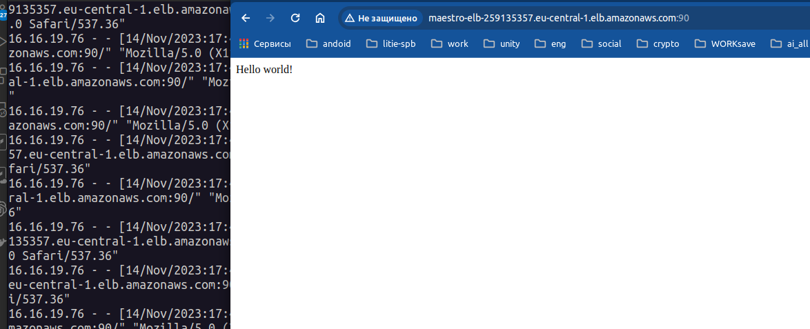

# Terraform 9. Раздел со звездочкой: сборка сайтов в AWS
Принял решение делать через terraform, так как был уже опыт.

1) !! Не сделан пункт 5
1) !! развернуть gatsby на t2.micro не вышло, поднимал на t2.small
1) Все параметры можно задавать через файл **terraform.tfvars**
1) Установка приложений через **provisioner c ansible** (playbook взял готовый, что бы ускорить процесс, но там ничего сверх сложного нет)
1) БД для wordpress реализована через  Amazon RDS (сайт доступен по 80 порту)
1) gatsby запускается через docker (сайт доступен по 90 порту)


### Из интересного для себя
нашел параметр, который не пересоздает instance каждый раз при terraform apply:
```
  lifecycle {
    ignore_changes        = [tags,security_groups]
  }
```

mysql -h terraform-20231113091521322200000001.cwjirezctx5q.eu-central-1.rds.amazonaws.com -u sammy -D wordpress -p


### Пример создания hosts для ansible
```ini
[ubuntu_nodes]
3.75.152.24
52.57.250.199

[all:vars]
ansible_ssh_private_key_file=~/.ssh/id_rsa.pub
ansible_user=**********
mysql_password=**********
mysql_root_password=*********
mysql_user=***********
database_host=******22200000001.cwjirezctx5q.eu-central-1.rds.amazonaws.com
mysql_db=*********
http_host_url=maestro-elb-3********0.eu-central-1.elb.amazonaws.com
http_port=80
```


### Добавил вывод информации:
```
Outputs:

ec2_global_ips = [
  [
    "3.**.*.**",
    "52.**.**.**",
  ],
]
maestro_db_host = [
  "terraform-2**************01.cwjirezctx5q.eu-central-1.rds.amazonaws.com",
]
maestro_elb_name = [
  "maestro-elb-3******0.eu-central-1.elb.amazonaws.com",
]

```

### Сайт с WP


### Сайт с Gatsby




### VPC

